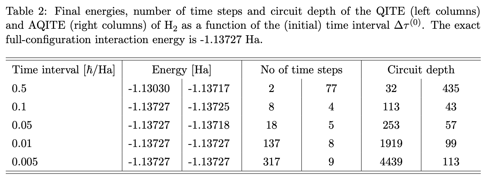
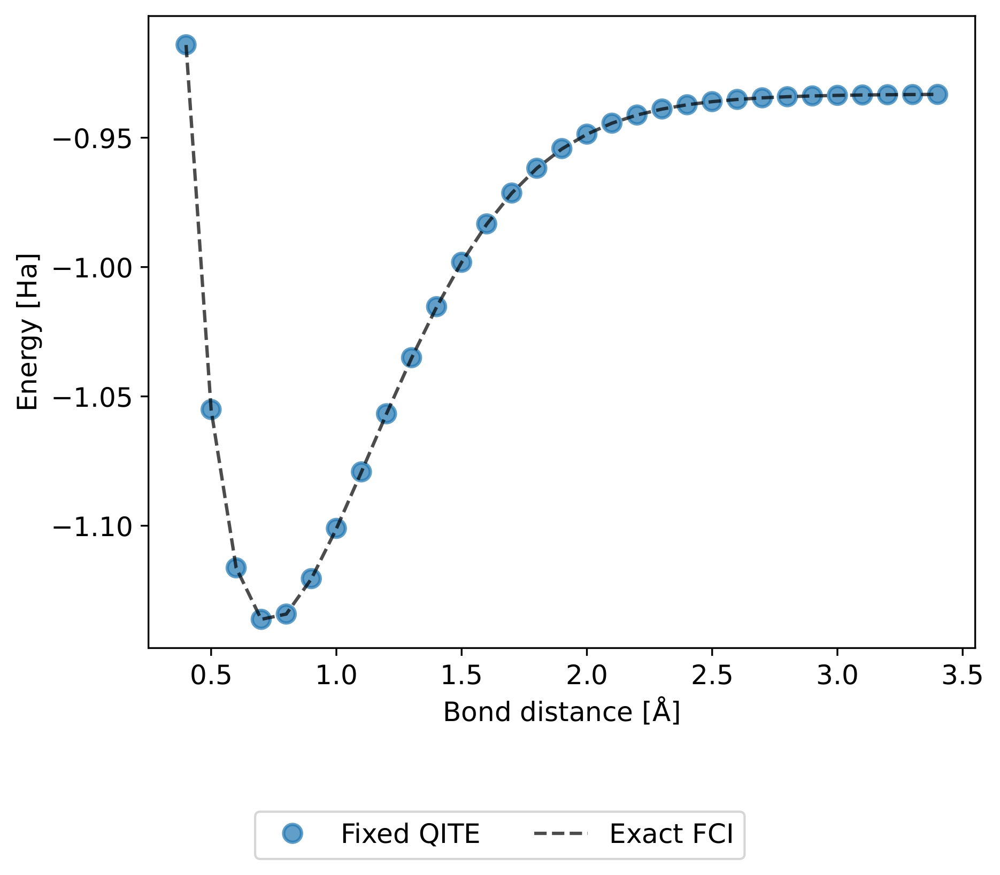
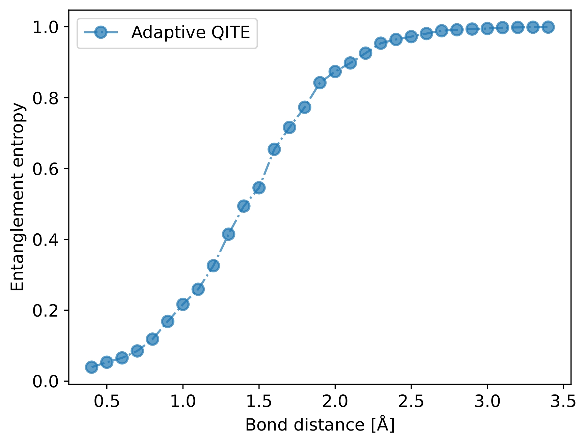

# Adaptive Quantum Imaginary-Time Evolution (AQITE) 

---

### 📖 Overview


adaptive-qite is the result of a semester project pseudo-supervised by Prof Nicolas Macris with the aim of improving the Quantum Imaginary-Time Evolution (QITE) algorithm proposed by Motta et al in the paper [Determining eigenstates and thermal states on a quantum computer using quantum imaginary time evolution](https://www.nature.com/articles/s41567-019-0704-4). In particular, the goal was to adjust the Trotter time-step ∆τ based on the angular velocity of the state vector in Hilbert space.

---

### 🛠 Installation

Prerequisites:

* [Qiskit](https://github.com/Qiskit/qiskit) (1.4.3)
* [Qiskit-nature](https://github.com/qiskit-community/qiskit-nature) (0.7.2)


```
# Clone the repository
git clone https://github.com/tjobin/adaptive-qite.git
cd adaptive-qite

# Install dependencies
pip install -r requirements.txt
```

---

### 🚀 Usage

#### Create appropriate folders

```
# Create folder for figures
mkdir figs
```
#### Set up the simulation in main.py

- Define the molecule of interest with the different parameters
- Define the mapper, the active space and the domain size
- Define the AQITE parameters
- Build the state and the Hamiltonian
- Run AQITE with run_adaptive_qite(...)

---

### 📊 Results
 The adaptive method proved 3x more robust to initial parameter selection than standard QITE. 

<p align="center">
  

We also successfully reproducing the H2 Potential Energy Surface across all entanglement regimes.

  <p align="center">
  
  

  
  


